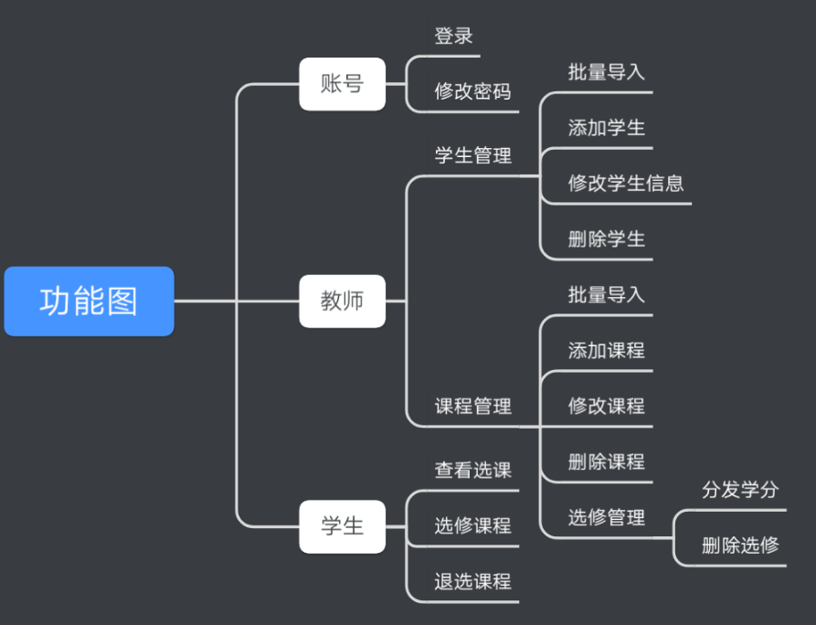

- [x] 项目说明，文档带过
- [x] 环境搭建
- [x] 对象》数据持久层》业务逻辑层》控制层 案列 USER
- [ ] 一些业务开发 页面编写
- [ ] 简单部署上线


# 简单选课管理系统

> 花半天时间编写一个简单的选课管理系统，非常简单的那种。。

## 一、功能需求




## 二、数据库设计

### 0. 共有属性

|    属性    |  类型   |    备注    |
| :--------: | :-----: | :--------: |
|     id     |   int   |            |
| createTime |  Date   |            |
| updateTime |  Date   |            |
|  deleted   | boolean | is_deleted |

### 1. 用户表

|   属性   |  类型  |          备注           |
| :------: | :----: | :---------------------: |
|   name   | String |                         |
|  number  | String |   工号/学号：用于登陆   |
| password | String |                         |
|   role   | short  | 0 教师（管理员） 1 学生 |
|  credit  |  int   |          学分           |
|  status  | short  |     0 不可用 1 可用     |

### 2. 课程表

|   属性    |  类型  |          备注          |
| :-------: | :----: | :--------------------: |
|   name    | String |                        |
|  teacher  |  User  |         授课人         |
|  credit   |  int   |          学分          |
| beginTime |  Date  | 开始后不可选，不可退选 |
|  endTime  |  Date  |   只有结束了才能结算   |
|   limit   |  int   |     限制多少人可选     |

### 3. 选课表

|  属性   |  类型  |           备注           |
| :-----: | :----: | :----------------------: |
| student |  User  |           学生           |
| course  | Course |           课程           |
|  grade  | double |   成绩（>60发方学分）    |
| status  | short  | 0 未结算 1 通过 2 未通过 |

## 三、技术选型及相关配置

### 1. 技术选型

#### 1.1 后端

|         技术          | 版本 |                             备注                             |
| :-------------------: | :--: | :----------------------------------------------------------: |
|         Java          | 1.8  |                                                              |
|         MySQL         | 5.7+ |                                                              |
|      Spring Boot      | 2.0+ |                                                              |
|    Spring Date JPA    |      |                                                              |
| Spring Date JPA Fenix |      | [为解决复杂动态 SQL 而生的 Spring Data JPA 扩展库](https://blinkfox.github.io/fenix/#/) |
|        Lombok         |      |                                                              |
|       Thymeleaf       |      |         模板引擎：[文档](https://www.thymeleaf.org/)         |

#### 1.2 前端

|   技术    | 版本 |                    备注                    |
| :-------: | :--: | :----------------------------------------: |
|    Vue    |      |                                            |
|  JQuery   |      |                                            |
|   Ajax    |      |                                            |
| BootStrap |      | 前端框架：[文档](https://www.bootcss.com/) |
| AdminLTE  |      |        基于BootStrap的后台管理模板         |


### 2. 常用配置

#### 2.1 Spring Boot 基础配置

application.yml

```yml
# 服务端口
server:
  port: 8080

spring:
  # 数据源配置
  datasource:
    driver-class-name: com.mysql.cj.jdbc.Driver
    url: jdbc:mysql://localhost:3306/elective?useUnicode=true&characterEncoding=utf-8&serverTimezone=UTC
    username: root
    password: 5211

  jpa:
    hibernate:
      # 更新或者创建数据表结构
      ddl-auto: update
    # 控制台显示SQL
    show-sql: true

# 模板引擎配置
thymeleaf:
  cache: false
  prefix:
    classpath: /templates
```

pom.xml

```xml
        <dependency>
            <groupId>org.apache.poi</groupId>
            <artifactId>poi</artifactId>
            <version>3.13</version>
        </dependency>
        <dependency>
            <groupId>org.apache.poi</groupId>
            <artifactId>poi-ooxml</artifactId>
            <version>3.13</version>
        </dependency>
        <dependency>
            <groupId>com.blinkfox</groupId>
            <artifactId>fenix-spring-boot-starter</artifactId>
            <version>2.4.2</version>
        </dependency>
```


#### 2.2 对象相关

BaseEntity.java

```java
@Data
@ToString
@MappedSuperclass
@EqualsAndHashCode
public class BaseEntity {

    /**
     * 更新时间
     */
    @JsonFormat(locale="zh", timezone="GMT+8", pattern="yyyy-MM-dd HH:mm:ss")
    @Column(name = "updated")
    private Timestamp updated;

    /**
     * 创建时间
     */
    @JsonFormat(locale="zh", timezone="GMT+8", pattern="yyyy-MM-dd HH:mm:ss")
    @Column(name = "created")
    private Timestamp created;

    /**
     * 删除标志
     */
    @Column(name = "deleted")
    private boolean deleted;

    /**
     * 初始化执行
     */
    @PrePersist
    protected void prePersist() {
        this.deleted = true;
        if (created == null) {
            created = new Timestamp(new Date().getTime());
        }

        if (updated == null) {
            updated = new Timestamp(new Date().getTime());
        }
    }

    /**
     * 更新时执行
     */
    @PreUpdate
    protected void preUpdate() {
        updated = new Timestamp(new Date().getTime());
    }
}
```

BasePageRPO.java

```java
@Data
@ApiModel(value = "BaseRPO请求参数对象", description = "可筛选的参数")
public class BasePageRPO {


    @ApiModelProperty(value = "页码", notes = "可以不填，默认1", example = "1")
    private int page = 1;

    @ApiModelProperty(value = "数量", notes = "可以不填，默认10", example = "10")
    private int size = 10;

    @ApiModelProperty(value = "排序字段", notes = "可以不填，默认createTime", example = "createTime")
    private String sort = "createTime";

    @ApiModelProperty(value = "排序方式", notes = "可以不填，默认降序", example = "DESC")
    private String sortType = "DESC";

    public Pageable buildPageable() {
        Sort sort;
        Sort.Direction direction;
        try {
            direction = Sort.Direction.fromString(sortType);
        } catch (Exception e) {
            direction = Sort.Direction.DESC;
        }

        if (StrUtil.isNotEmpty(this.sort)) {
            sort = Sort.by(direction, this.sort);
        } else {
            sort = Sort.by(direction, "createTime");
        }

        return PageRequest.of(this.page - 1, size, sort);
    }

    public Pageable buildNativeSqlPageable() {
        Sort sort;
        Sort.Direction direction;
        try {
            direction = Sort.Direction.fromString(sortType);
        } catch (Exception e) {
            direction = Sort.Direction.DESC;
        }

        if (StrUtil.isNotEmpty(this.sort)) {

            sort = Sort.by(direction, StrUtil.toUnderlineCase(this.sort));
        } else {
            sort = Sort.by(direction, "create_time");
        }

        return PageRequest.of(this.page - 1, size, sort);
    }


}

```

ResponseResult.java

```java
@Data
public class ResponseResult<T> implements Serializable {

    private static final long serialVersionUID = 194200730187456280L;

    /**
     * 状态码
     */
    private Integer code;

    /**
     * 消息
     */
    private String message;

    /**
     * 返回对象
     */
    private T data;

    public ResponseResult() {
        super();
    }

    public ResponseResult(Integer code) {
        super();
        this.code = code;
    }

    public ResponseResult(Integer code, String message) {
        super();
        this.code = code;
        this.message = message;
    }

    public ResponseResult(Integer code, Throwable throwable) {
        super();
        this.code = code;
        this.message = throwable.getMessage();
    }

    public ResponseResult(Integer code, T data) {
        super();
        this.code = code;
        this.data = data;
    }

    public ResponseResult(Integer code, String message, T data) {
        super();
        this.code = code;
        this.message = message;
        this.data = data;
    }
}
```

```java
@Data
public class SystemRuntimeException extends RuntimeException {
    private int code;
    private String message;
    public SystemRuntimeException(){
        super("请求异常");
        this.code = 500;
        this.message = "请求异常";
    }
    public SystemRuntimeException(int code, String message){
        super(message);
        this.code = code;
        this.message = message;
    }

    public SystemRuntimeException(String message){
        super(message);
        this.code = 500;
        this.message = message;
    }
}
```

#### 2.3 MVC 相关

LoginInterceptor.java

```java
@Configuration
public class WebConfigurer implements WebMvcConfigurer {

    // 将 LoginInterceptor 注入到 WebConfigurer 中
    @Autowired
    private LoginInterceptor loginInterceptor;

    // 这个方法是用来配置静态资源的，比如html，js，css，等等
    @Override
    public void addResourceHandlers(ResourceHandlerRegistry registry) {
    }
    
    // 在 WebConfigurer 中的 addInterceptors 中添加拦截器，使其生效
    // 这个方法用来注册拦截器，我们自己写好的拦截器需要通过这里添加注册才能生效
    // addPathPatterns 用来设置拦截路径，excludePathPatterns 用来设置白名单，也就是不需要触发这个拦截器的路径。
    @Override
    public void addInterceptors(InterceptorRegistry registry) {
        // addPathPatterns("/**") 表示拦截所有的请求，
        // excludePathPatterns("/login", "/register") 表示除了登陆与注册之外，因为登陆注册不需要登陆也可以访问
        registry.addInterceptor(loginInterceptor)
                .addPathPatterns("/**")
                .excludePathPatterns("/login");
    }
}
```

LoginInterceptor.java

```java
@Component
public class LoginInterceptor implements HandlerInterceptor {

    @Override
    public boolean preHandle(HttpServletRequest request, HttpServletResponse response, Object handler) throws Exception {
        final Object obj = request.getSession().getAttribute("user_session");
        // 未登录
        if (obj == null) {
            response.sendRedirect("/admin/login");
            return false;
        } else {
            // 放行
            return true;
        }
    }

    @Override
    public void postHandle(HttpServletRequest request, HttpServletResponse response, Object handler, ModelAndView modelAndView) throws Exception {
    }

    @Override
    public void afterCompletion(HttpServletRequest request, HttpServletResponse response, Object handler, Exception ex) throws Exception {
    }
}
```

#### 2.4 Fenix 配置

```java
import com.blinkfox.fenix.EnableFenix;

import org.springframework.boot.SpringApplication;
import org.springframework.boot.autoconfigure.SpringBootApplication;

/**
 * 请在 Spring Boot 应用中标注 {code @EnableFenix} 注解.
 *
 * @author blinkfox on 2020-02-01.
 */
@EnableFenix
@SpringBootApplication
public class DemoApplication {

    public static void main(String[] args) {
        SpringApplication.run(DemoApplication.class, args);
    }
}
```

```yml
# Fenix 的几个配置项、默认值及详细说明，通常情况下你不需要填写这些配置信息（下面的配置代码也都可以删掉）.
fenix:
  # v2.4.1 版本新增，表示是否开启 debug 调试模式，默认 false。
  # 当开启之后，对 XML 中的 SQL 会进行实时文件流的读取和解析，不需要重启服务。切记仅在开发环境中开启此功能.
  debug: false
  # 成功加载 Fenix 配置信息后，是否打印启动 banner，默认 true.
  print-banner: true
  # 是否打印 Fenix 生成的 SQL 信息，默认为空.
  # 当该值为空时，会读取 'spring.jpa.show-sql' 的值，为 true 就打印 SQL 信息，否则不打印.
  # 当该值为 true 时，就打印 SQL 信息，否则不打印. 生产环境不建议设置为 true.
  print-sql:
  # 扫描 Fenix XML 文件的所在位置，默认是 fenix 目录及子目录，可以用 yaml 文件方式配置多个值.
  xml-locations: fenix
  # 扫描你自定义的 XML 标签处理器的位置，默认为空，可以是包路径，也可以是 Java 或 class 文件的全路径名
  # 可以配置多个值，不过一般情况下，你不自定义自己的 XML 标签和处理器的话，不需要配置这个值.
  handler-locations:
  # v2.2.0 版本新增的配置项，表示自定义的继承自 AbstractPredicateHandler 的子类的全路径名
  # 可以配置多个值，通常情况下，你也不需要配置这个值.
  predicate-handlers:
```

```xml
<?xml version="1.0" encoding="UTF-8"?>
<fenixs namespace="xx.xx.repository.xx">

    <fenix id="xx">
        select t from xx t where xx = 1
        <andEqual field="t.xx" value="xx"></andEqual>

        <andLike match="?param.xx != empty" field="t.xx" value="param.xx"></andLike>
        <andEqual match="?param.xx != empty" field="t.xx" value="param.xx"></andEqual>

        @if{?param.searchValue != empty}
        AND (t.xx like '%@{param.searchValue}%' or t.xx like '%@{param.searchValue}%')
        @end{}
    </fenix>

</fenixs>
```

#### 2.5 CRUD 封装

```java
public interface CrudService<DOMAIN, ID> {

    /**
     * 根据删除状态查询
     *
     * @param deleted
     * @return
     */
    List<DOMAIN> listByDeleted(boolean deleted);

    /**
     * 查询全部
     *
     * @return List
     */
    @NonNull
    List<DOMAIN> listAll();

    /**
     * 排序查询全部
     *
     * @param sort sort
     * @return List
     */
    @NonNull
    List<DOMAIN> listAll(@NonNull Sort sort);

    /**
     * 分页查询全部
     *
     * @param pageable pageable
     * @return Page
     */
    @NonNull
    Page<DOMAIN> listAll(@NonNull Pageable pageable);

    /**
     * 按IDs获取
     *
     * @param ids
     * @return
     */
    List<DOMAIN> listAll(Iterable<ID> ids);

    /**
     * 按ID获取
     *
     * @param id id
     * @return Optional
     */
    @NonNull
    DOMAIN getById(@NonNull ID id);

    /**
     * 判断id是否存在
     *
     * @param id
     * @return boolean
     */
    boolean existsById(@NonNull ID id);

    /**
     * 统计所有
     *
     * @return long
     */
    long count();

    /**
     * 按对象保存
     *
     * @param domain domain
     * @return DOMAIN
     */
    @NonNull
    DOMAIN create(@NonNull DOMAIN domain);

    /**
     * 按对象更新
     *
     * @param domain domain
     * @return DOMAIN
     */
    @NonNull
    DOMAIN update(@NonNull DOMAIN domain);

    /**
     * 按ID删除
     *
     * @param id id
     * @return DOMAIN
     * @throws NotFoundException If the specified id does not exist
     */
    @NonNull
    DOMAIN removeById(@NonNull ID id);

    /**
     * 按对象删除
     *
     * @param domain domain
     */
    void remove(@NonNull DOMAIN domain);
}
```


```java 
public abstract class AbstractCrudService<DOMAIN, ID> implements CrudService<DOMAIN, ID> {


    private final String domainName;

    private final JpaRepository<DOMAIN, ID> baseRepository;

    protected AbstractCrudService(BaseRepository<DOMAIN, ID> baseRepository) {
        this.baseRepository = baseRepository;

        // Get domain name
        Class<DOMAIN> domainClass = (Class<DOMAIN>) fetchType(0);
        domainName = domainClass.getSimpleName();
    }

    /**
     * Gets actual generic type.
     *
     * @param index generic type index
     * @return real generic type will be returned
     */
    private Type fetchType(int index) {
        Assert.isTrue(index >= 0 && index <= 1, "type index must be between 0 to 1");

        return ((ParameterizedType) this.getClass().getGenericSuperclass()).getActualTypeArguments()[index];
    }

    /**
     * 根据删除状态查询
     *
     * @param deleted
     * @return
     */
    public List<DOMAIN> listByDeleted(boolean deleted){
        return baseRepository.findAllByDeleted(deleted);
    }

    /**
     * 查询全部
     *
     * @return List
     */
    @Override
    public List<DOMAIN> listAll() {
        return baseRepository.findAll();
    }

    /**
     * 排序查询全部
     *
     * @param sort sort
     * @return List
     */
    @Override
    public List<DOMAIN> listAll(Sort sort) {
        Assert.notNull(sort, "Sort info must not be null");

        return baseRepository.findAll(sort);
    }

    /**
     * 分页查询全部
     *
     * @param pageable pageable
     * @return Page
     */
    @Override
    public Page<DOMAIN> listAll(Pageable pageable) {
        Assert.notNull(pageable, "Pageable info must not be null");

        return baseRepository.findAll(pageable);
    }

    /**
     * 按IDs获取
     *
     * @param ids
     * @return
     */
    @Override
    public List<DOMAIN> listAll(Iterable<ID> ids) {
        return baseRepository.findAllById(ids);
    }

    /**
     * 按ID获取
     *
     * @param id id
     * @return Optional
     */
    @Override
    public DOMAIN getById(ID id) {
        Assert.notNull(id, domainName + " id must not be null");

        return  baseRepository.findById(id).get();
    }

    /**
     * 判断id是否存在
     *
     * @param id id
     * @return boolean
     */
    @Override
    public boolean existsById(ID id) {
        Assert.notNull(id, domainName + " id must not be null");

        return baseRepository.existsById(id);
    }

    /**
     * 统计所有
     *
     * @return long
     */
    @Override
    public long count() {
        return baseRepository.count();
    }

    /**
     * 按对象保存
     *
     * @param domain domain
     * @return DOMAIN
     */
    @Override
    public DOMAIN create(DOMAIN domain) {
        Assert.notNull(domain, domainName + " data must not be null");

        return baseRepository.save(domain);
    }

    /**
     * 按对象更新
     *
     * @param domain domain
     * @return DOMAIN
     */
    @Override
    public DOMAIN update(DOMAIN domain) {
        Assert.notNull(domain, domainName + " data must not be null");

        return baseRepository.saveAndFlush(domain);
    }

    /**
     * 按ID删除
     *
     * @param id id
     * @return DOMAIN
     * @throws NotFoundException If the specified id does not exist
     */
    @Override
    public DOMAIN removeById(ID id) {
        // Get non null domain by id
        DOMAIN domain = getById(id);

        // Remove it
        remove(domain);

        // return the deleted domain
        return domain;
    }

    /**
     * 按对象删除
     *
     * @param domain domain
     */
    @Override
    public void remove(DOMAIN domain) {
        Assert.notNull(domain, domainName + " data must not be null");

        baseRepository.delete(domain);
    }
}
```

#### 2.6 其它

```
DigestUtils.md5DigestAsHex(password.getBytes())
```

